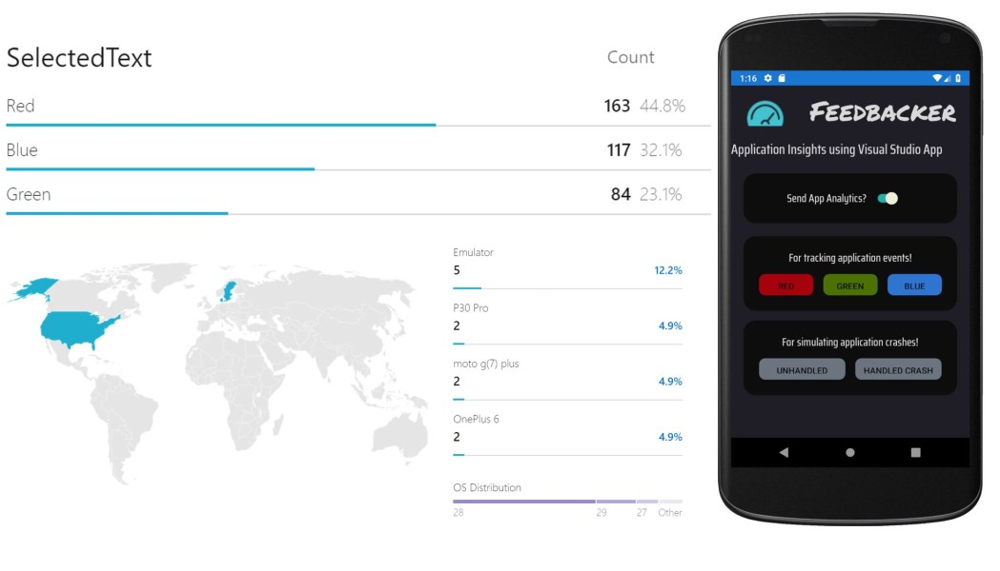
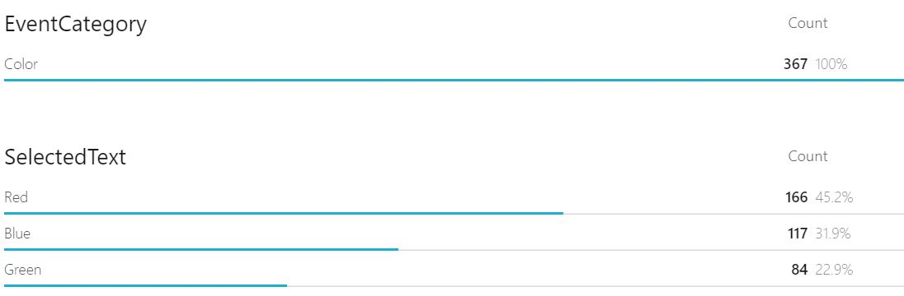
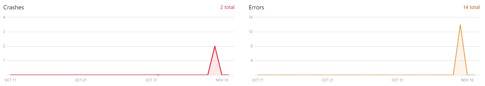

# Feedbacker 
## Xamarin Android Mobile Application for Exploring Application Analytics using Visual Studio App Center




The goal of the application is to generate analytic events and crashes for monitoring via the visual studio app center.

## Usage
### - Mobile Application
In order to use the mobile application, create an app at the visual studio app center and choose the platform to be Android/Xamarin. Place the application key in the OnStart method in App.Xaml.cs
```
AppCenter.Start("android=YOUR_APP_SECRET_HERE;",
                  typeof(Analytics), typeof(Crashes));
```
### - Unit Testing
UI unit test can added in the app center. In this case, choose Xamarin UI test and the set of physical devices to test the app on. Note that Xamarin cloud testing is offered as a 30 day free trail at the time of writing. To run the unit test, App Center CLI is required. This can be installed using (requires NodeJS)
```
npm install -g appcenter-cli
```

App center provides the command to run the unit test from CLI. In my case, the command looked like:

```
appcenter test run uitest --app "[USERNAME/APPNAME]]" --devices [CHOSEN DEVICE SET ID] --app-path [PATH TO APK FILE] --test-series "launch-tests" --locale "en_US" --build-dir [PATH TO UNIT TEST DIR]
```
Note: It might be required to add a --uitest-tools-dir flag to the above command. In my case, I need to download the xamarin.uitest.3.0.3 NuGet package, unzip it and add the path to tools folder with the above flag, for the unit test to run successfully.


## Analytics
Events are added following during the tap event of a button
```
Analytics.TrackEvent("Color selected", new Dictionary<string, string> {
                       { "EventCategory", "Color" },
                        { "SelectedText", "Red"}
                   });
```
Which generated the following event monitor at app center



Unhandled crashes can be generated using the SDK using
```
Crashes.GenerateTestCrash();
```
The handled crashes are generated using the follows in this application
```
                try
                   {
                       //Causing a divide by zero exception
                       int denom = 0;
                       int fraction = 1 / denom;
                   }
                   catch (Exception exception)
                   {
                       var properties = new Dictionary<string, string>
                        {
                            { "Library", "Calculations" },
                            { "Function", "Func1"}
                        };
                       Crashes.TrackError(exception, properties);
                   }
```
Which created the following diagnostic monitor at the app center


